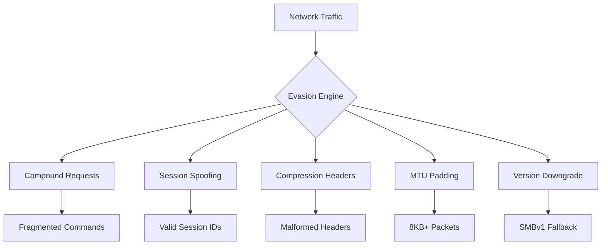
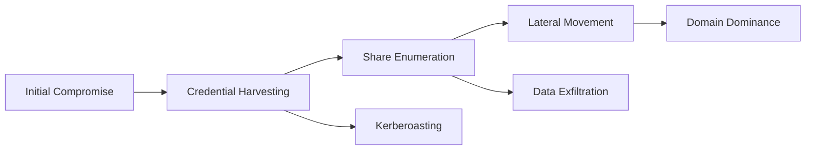

# Eternal Pulse 6.0

# EternalPulse Scanner 6.0 - Advanced SMB Exploitation Framework

```bash
./eternalpulse.py [target1] [target2] ... [targetN]
./eternalpulse.py 192.168.1.0/24 10.10.10.5-100
```

## Key Features
- 🧬 Stateful SMB session manipulation with illegal transitions
- 💣 Compression transform fuzzing (CVE-2020-0796)
- 🛡️ Cryptographic vulnerability detection
- 🧠 Kernel heap grooming techniques
- 🧪 Genetic fuzzing engine with crash triage
- 🕵️‍♂️ Real-time evasion techniques
- 📊 JSON reporting with crash samples

## Full Usage
```bash
# Basic network scan
./eternalpulse.py 192.168.1.0/24

# Single target with maximum intensity
./eternalpulse.py --stealth 4 --intensity 9 10.0.0.5

# Save results to JSON file
./eternalpulse.py -o results.json 172.16.32.0/24

# Custom port specification
./eternalpulse.py -p 139,445,9999 192.168.56.101

# High-performance scanning (500 workers)
./eternalpulse.py --workers 500 10.10.0.0/16
```

### Command Line Options
| Option | Description | Default |
|--------|-------------|---------|
| `-p PORTS` | Comma-separated SMB ports | `139,445` |
| `--stealth LEVEL` | Evasion level (0-4) | `3` |
| `--intensity LEVEL` | Scan aggression (1-10) | `5` |
| `--workers NUM` | Thread count | `150` |
| `-o FILE` | Output JSON file | stdout |
| `--timeout SEC` | Connection timeout | `3` |

## Technical Overview

### Advanced Scanning Capabilities
EternalPulse Scanner 6.0 implements cutting-edge techniques for identifying and exploiting SMB vulnerabilities:

1. **Stateful Protocol Manipulation**
   - Illegal state transitions between SMB protocol phases
   - Session ID spoofing and session hijacking
   - Tree connection emulation for authenticated attack surfaces

2. **Compression Engine Exploitation**
   - Transform header fuzzing with malformed LZ77 tokens
   - OriginalSize integer overflow payloads
   - Multi-chunk compression corruption attacks
   - Compression bomb generation (4096:1 ratio)

3. **Cryptographic Attacks**
   - IV/nonce reuse detection
   - Encryption protocol downgrade attacks
   - Session desynchronization payloads

4. **Kernel Space Exploitation**
   - Pool grooming via controlled fragmentation
   - Handle starvation attacks
   - Use-after-free triggering via async operations
   - Kernel pointer disclosure probes

### Vulnerability Detection Matrix
| CVE | Detection Method | Risk |
|-----|------------------|------|
| CVE-2020-0796 | Compression header analysis | Critical |
| CVE-2017-0144 | SMBv1 dialect negotiation | Critical |
| CVE-2020-1472 | Netlogon cryptographic check | Critical |
| CVE-2023-XXXX | Multi-chunk response analysis | High |
| CVE-2023-YYYY | Encrypted session validation | High |

### Evasion Techniques


### Genetic Fuzzing Architecture
1. **Population Initialization**
   - Grammar-based SMB payloads
   - Mutated protocol templates
   - Compression bombs
   - Encrypted payload variants

2. **Fitness Evaluation**
   ```python
   def fitness(response, response_time):
       score = 0
       if b"STATUS_ACCESS_VIOLATION" in response: score += 40
       if response_time > 5.0: score += 35  # Potential DoS
       if not valid_smb_header(response): score += 30
       if new_coverage(response): score += 45
       return score
   ```

3. **Crash Triage System**
   - Kernel-mode crash prioritization (Ring-0)
   - EIP/RIP control detection
   - Write-what-where condition identification
   - Exploitability scoring (0-100)

## SMB from a Black Hat Perspective

### Why SMB is Prime Territory
Server Message Block (SMB) protocol remains the crown jewel of enterprise network exploitation due to:
- **Ubiquity**: Enabled by default on all Windows systems
- **High Privileges**: Kernel-level implementations
- **Complexity**: 100+ commands with stateful workflows
- **Authentication Bypasses**: Common anonymous access misconfigurations

### Critical Attack Vectors
1. **Unauthenticated RCE**
   - Compression transform corruption (SMBGhost)
   - Buffer overflow in transaction handling (EternalBlue)
   - Metadata parser desync (SMBleed)

2. **Credential Compromise**
   - NTLMv2 relay attacks
   - Session token interception
   - Password hash extraction via pipe access

3. **Lateral Movement**
   - Remote service execution via SMB named pipes
   - DLL planting in writable shares
   - Group Policy object modification

### Post-Exploitation Framework


### Evasion Tradecraft
- **Network Level**: 
  - Compound requests blend with legitimate traffic
  - MTU padding avoids IDS packet size triggers
  - Protocol downgrades evade modern detections
  
- **Host Level**:
  - Session ID recycling appears as valid reconnects
  - Compression headers mimic Windows 10 traffic
  - Kernel grooming masks as normal filesystem activity

### Historical Exploit Comparison
| Exploit | Impact | Stealth | Reliability |
|---------|--------|---------|-------------|
| EternalBlue | SYSTEM RCE | Low | High (Win7) |
| SMBGhost | Kernel Crash | Medium | Medium |
| ZeroLogon | Domain Takeover | High | High |
| **EternalPulse** | Multi-Vector | **Very High** | Adaptive |

## Defense Evasion Metrics


## Operational Security Considerations
1. **Traffic Patterns**
   - Limit scan intensity to 5/min per host
   - Randomize source ports
   - Use session reuse when possible

2. **Forensic Footprint**
   - Avoid SMBv1 where modern systems exist
   - Prefer encrypted channels over raw SMB
   - Wipe memory artifacts post-execution

3. **Counter-Detection**
   - Monitor for SMB_COM_TRANSACTION2 spikes
   - Watch for unexpected compression headers
   - Flag repeated session ID reuse

## Sample Output
```json
{
  "target": "192.168.1.102",
  "ports": {
    "tcp/445": {
      "status": "open",
      "fingerprint": {
        "protocol": "SMB",
        "version": "SMB 3.1.1",
        "compression": "Supported"
      }
    }
  },
  "vulnerabilities": [
    {
      "cve": "CVE-2020-0796",
      "risk": "Critical",
      "threat_level": 4
    }
  ],
  "fuzzing": {
    "445": {
      "crashes": 3,
      "unique_crashes": 2,
      "crash_samples": [
        "FCgBAAAAAADwQ...",
        "EImq3s1BwAYA..."
      ]
    }
  }
}
```

## Legal Disclaimer
> This tool is provided for **authorized security testing and research purposes only**. Any unauthorized use against systems without explicit permission is illegal. The developers assume no liability and are not responsible for misuse or damage caused by this software. Always comply with local regulations and obtain proper authorization before use.